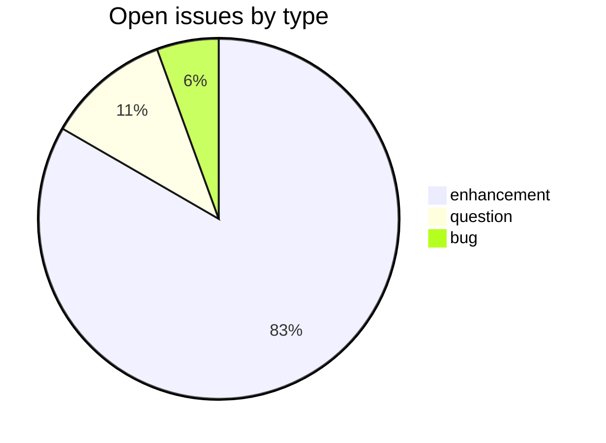
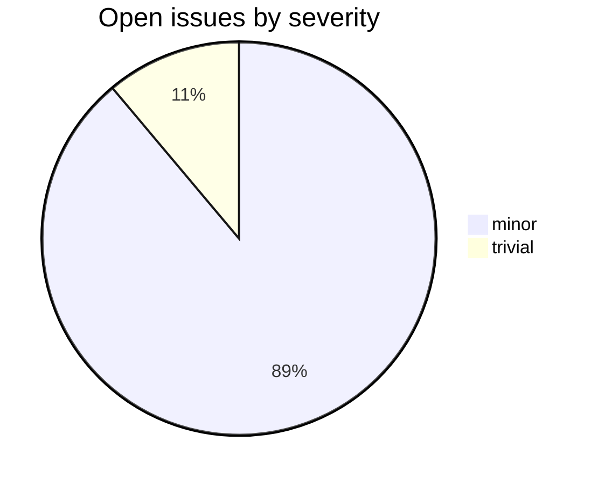

# alternateheadwords

_Created: 19-06-2026 · Last updated: 11-07-2026_

CDSL **linking-tool** repository in the [Sanskrit Lexicon](https://github.com/sanskrit-lexicon) project.
It extracts **alternate headwords** (variant spellings, embedded sub-headwords, and
preverb-stripped forms) from source dictionaries, so that lookups and cross-dictionary
links can resolve headword forms that differ from the printed lemma.

## What it does

Each source dictionary is processed from its exported headword file (`{DICT}hw0.txt`)
into a set of derived alternate-headword lists under
[`data/`](https://github.com/sanskrit-lexicon/alternateheadwords/tree/main/data), one
subfolder per dictionary. Dictionaries currently processed:

| Code | Notes |
|---|---|
| AE, AP, AP90, PD, PW, PWG, SKD, STC, VCP | per-dictionary alternate-headword lists |
| PWGpreverb, PWpreverb | preverb-stripped variants for PWG / PW |

The combined Sanskrit headword master lives in
[`data/sanhw2.txt`](https://github.com/sanskrit-lexicon/alternateheadwords/blob/main/data/sanhw2.txt).

## Tech stack

- **Runtime**: Python (plain scripts, no framework or build system)
- **Input**: exported dictionary headword text (`{DICT}hw0.txt`) from the `csl-orig` / Cologne local copies
- **Output**: per-dictionary alternate-headword lists (`{DICT}ehw0.txt` … `ehw3.txt`, `{DICT}_unique_ehw.txt`)

Core scripts live in
[`scripts/`](https://github.com/sanskrit-lexicon/alternateheadwords/tree/main/scripts) —
[`ahw.py`](https://github.com/sanskrit-lexicon/alternateheadwords/blob/main/scripts/ahw.py)
and [`ahw1.py`](https://github.com/sanskrit-lexicon/alternateheadwords/blob/main/scripts/ahw1.py)
(alternate-headword extraction, originally authored by Dr. Dhaval Patel),
[`embedded.py`](https://github.com/sanskrit-lexicon/alternateheadwords/blob/main/scripts/embedded.py),
[`transcoder.py`](https://github.com/sanskrit-lexicon/alternateheadwords/blob/main/scripts/transcoder.py),
[`levenshtein.py`](https://github.com/sanskrit-lexicon/alternateheadwords/blob/main/scripts/levenshtein.py),
and [`suggest.py`](https://github.com/sanskrit-lexicon/alternateheadwords/blob/main/scripts/suggest.py).
The end-to-end regeneration steps are in
[`redo.sh`](https://github.com/sanskrit-lexicon/alternateheadwords/blob/main/redo.sh).

## Issues overview

As of 11-07-2026 — **Total 25 · Open 18 · Closed 7**.

### Open issues by milestone

| Milestone | Open |
|---|---:|
| User Experience | 15 |
| Data Quality | 1 |
| Community | 2 |

### Open issues by type

### Open issues by severity

## GitHub issue conventions

Follows the [Cologne tooling-repo taxonomy](https://github.com/sanskrit-lexicon/csl-observatory/blob/main/runbook/cologne-tooling-runbook.md).
Every issue carries exactly one type label, one severity, and one milestone:

- **9 type labels**: `bug`, `feature`, `enhancement`, `performance`, `tech-debt`, `security`, `documentation`, `infrastructure`, `question`
- **4 severity levels**: `trivial`, `minor`, `major`, `critical`
- **5 milestones**: API Stability, User Experience, Data Quality, Developer Experience, Community
- **Domain labels** scoped to this linking-tool: `domain:link-resolution`, `domain:source-mapping`, `domain:coverage`
- **Org project**: [Tooling Roadmap](https://github.com/orgs/sanskrit-lexicon/projects/9)

See [CLAUDE.md](https://github.com/sanskrit-lexicon/alternateheadwords/blob/main/CLAUDE.md)
for the full label definitions. Source-text corrections into Cologne dictionaries follow the
canonical [correction workflow](https://github.com/sanskrit-lexicon/csl-corrections/blob/main/docs/correction-workflow.md).

---

_Dr. Mārcis Gasūns_
