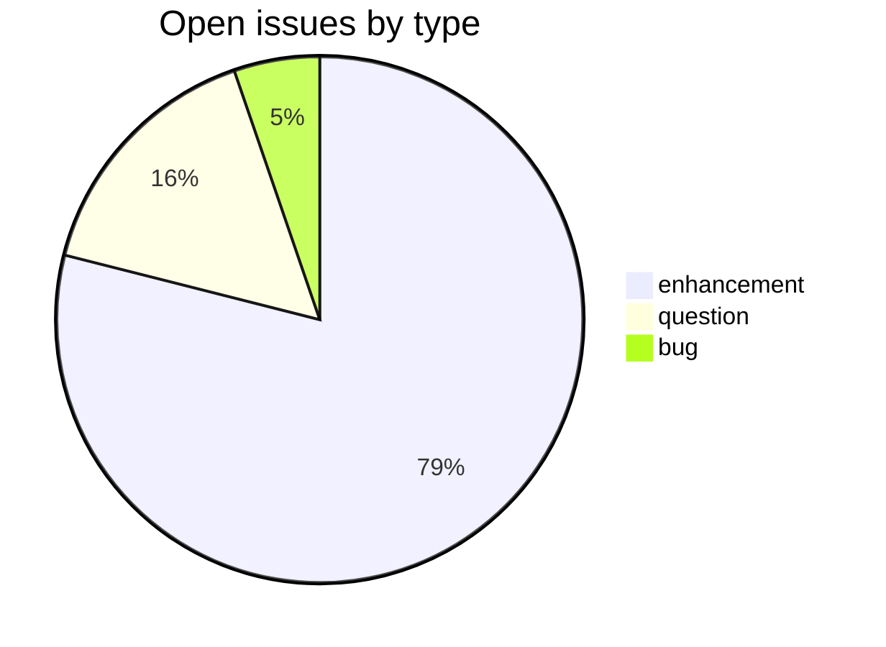
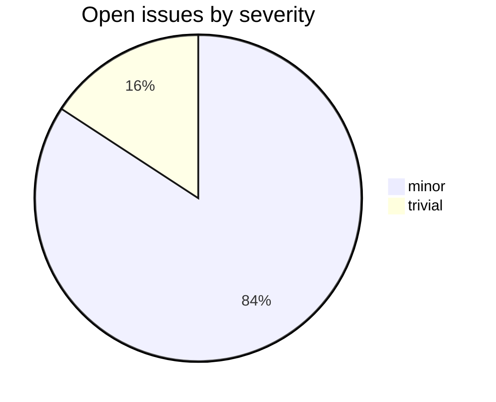

# alternateheadwords

CDSL **linking-tool** repository in the Sanskrit Lexicon project.
Prepares lists of alternate headwords extracted from source dictionaries.

## Tech Stack

- **Runtime**: Python 3
- **Build**: plain `python` scripts
- **Input**: source dictionary XML/text from `csl-orig`
- **Output**: per-dictionary alternate headword lists

## Issues Overview

**Total**: 25 | **Open**: 19 | **Closed**: 6

### By Milestone

| Milestone | Open | Closed | Total |
|---|---:|---:|---:|
| API Stability | 0 | 0 | 0 |
| User Experience | 15 | 0 | 15 |
| Data Quality | 1 | 0 | 1 |
| Developer Experience | 0 | 0 | 0 |
| Community | 3 | 0 | 3 |

### By Type

### By Severity

## GitHub Issue Conventions

Follows the [Cologne tooling-repo taxonomy](https://github.com/sanskrit-lexicon/csl-observatory/blob/main/runbook/cologne-tooling-runbook.md):

- **17 type labels** across 5 categories (code quality, features, docs, infra, research)
- **4 severity levels**: trivial, minor, major, critical
- **5 milestones**: API Stability, User Experience, Data Quality, Developer Experience, Community
- **Domain labels** scoped to linking-tool: `domain:link-resolution`, `domain:source-mapping`, `domain:coverage`
- **Org Project**: [Tooling Roadmap](https://github.com/orgs/sanskrit-lexicon/projects/9)

See [CLAUDE.md](CLAUDE.md) for full definitions.

---
*Generated by Cologne Tooling Runbook on 2026-05-29*
